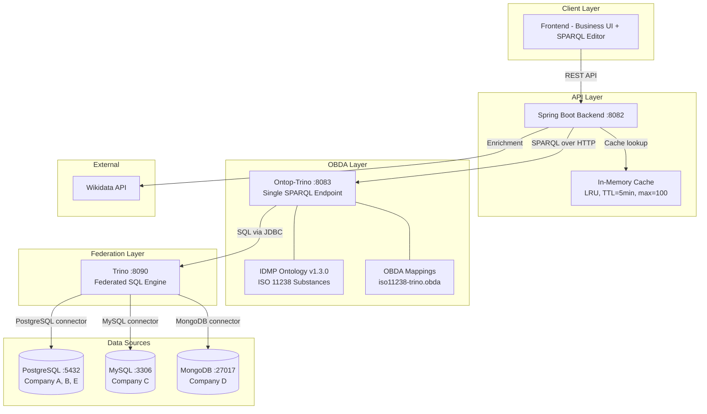
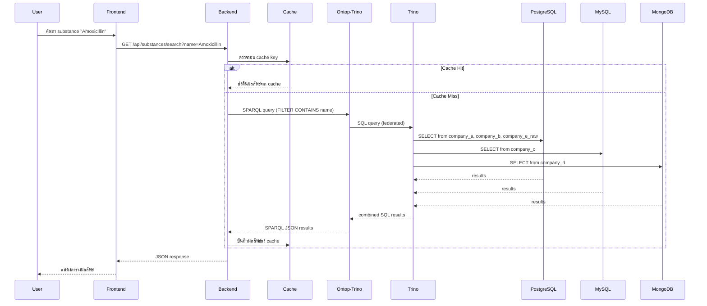
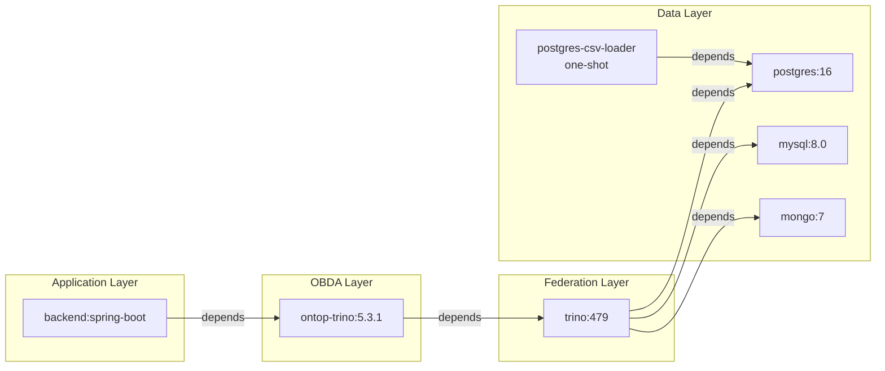
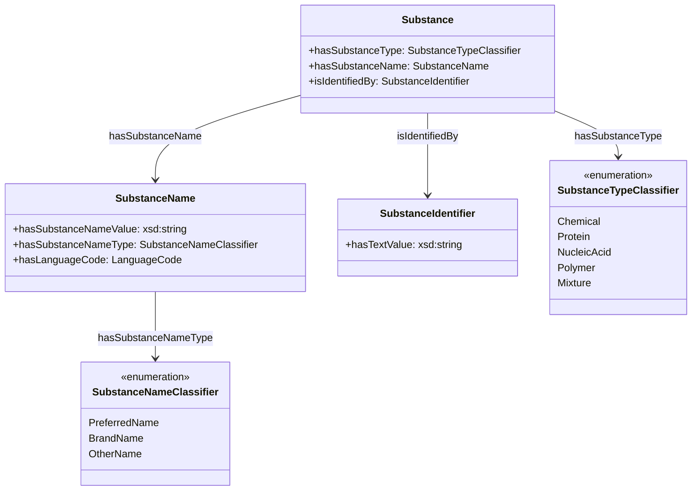

# Design Document — ระบบ IDMP OBDA (Ontology-Based Data Access)

## Overview

ระบบ IDMP OBDA เป็นระบบ Ontology-Based Data Access ที่รวมข้อมูลสารออกฤทธิ์ (Substance) จาก 5 แหล่งข้อมูล (Company A-E) ที่มีโครงสร้างต่างกัน (PostgreSQL, MySQL, MongoDB, CSV) ให้เป็นมุมมองเดียวกันผ่าน IDMP ISO 11238 Ontology โดยใช้สถาปัตยกรรม single SPARQL endpoint ผ่าน Ontop-Trino federation

### เป้าหมายหลักของ Design

1. **Cleanup สถาปัตยกรรม** — ลบ service/config ที่ไม่ใช้แล้ว (ontop-postgres, ontop-mysql) ให้เหลือ single endpoint เท่านั้น
2. **Business API Layer** — เพิ่ม REST endpoints สำหรับ substance search, details, cross-source matching โดยใช้ SPARQL query templates
3. **Business-Friendly Frontend** — เพิ่มหน้า UI สำหรับ business user ที่ไม่ต้องเขียน SPARQL
4. **Extensibility** — ออกแบบ modular structure สำหรับเพิ่ม ISO IDMP modules ในอนาคต
5. **Demo Data Enhancement** — เพิ่มข้อมูลให้สมจริงและครอบคลุมมากขึ้น
6. **Quality & Observability** — เพิ่ม health checks, validation, caching, tests
7. **Production-Ready Docker** — ปรับ docker-compose ให้พร้อม deploy

### Technology Stack

| Layer | Technology | Version |
|-------|-----------|---------|
| OBDA Engine | Ontop | 5.3.1 |
| Federation | Trino | 479 |
| Backend | Spring Boot | 3.2.5 (Java 17) |
| Frontend | Vanilla HTML/JS | - |
| DB: Company A,B,E | PostgreSQL | 16 |
| DB: Company C | MySQL | 8.0 |
| DB: Company D | MongoDB | 7 |
| Orchestration | Docker Compose | - |

## Architecture

### High-Level Architecture



### Query Flow (Single SPARQL Endpoint)



### Design Decisions

| Decision | เหตุผล |
|----------|--------|
| Single Ontop-Trino endpoint แทน multi-endpoint | เป็น true OBDA — one query across all sources, ลดความซับซ้อนของ client |
| In-memory cache (ConcurrentHashMap + LRU) แทน Redis | ระบบ demo ไม่ต้องการ distributed cache, ลดจำนวน service |
| Vanilla HTML/JS frontend แทน React/Vue | สอดคล้องกับ codebase เดิม, ลด build complexity สำหรับ demo |
| SPARQL templates เป็น Java constants แทน external files | ง่ายต่อการ maintain, compile-time safety, IDE support |
| Modular OBDA mapping files แยกตาม ISO module | รองรับการเพิ่ม module ใหม่โดยไม่กระทบ mapping เดิม |
| Spring Boot Caffeine/ConcurrentHashMap cache | Lightweight, ไม่ต้อง external dependency เพิ่ม |


## Components and Interfaces

### 1. Backend API Components (Spring Boot)

#### 1.1 Package Structure (Modular by ISO Module)

```
backend/src/main/java/com/example/idmp/
├── IdmpBackendApplication.java
├── config/
│   ├── OntopConfig.java              # RestClient bean, cache config
│   ├── OntopProperties.java          # Single endpoint configuration
│   └── CacheConfig.java              # Cache configuration (TTL, max size)
├── service/
│   ├── OntopClient.java              # SPARQL HTTP client (single endpoint)
│   ├── SparqlCacheService.java       # LRU cache with TTL
│   ├── WikidataEnrichmentService.java
│   └── iso11238/                     # ISO 11238 module services
│       └── SubstanceService.java     # Substance business logic
├── util/
│   └── iso11238/                     # SPARQL templates per ISO module
│       └── SubstanceSparqlTemplates.java
├── web/
│   ├── SparqlController.java         # Raw SPARQL proxy (existing)
│   ├── WikidataController.java       # Wikidata enrichment (existing)
│   ├── HealthController.java         # Health & validation endpoints
│   ├── CacheController.java          # Cache management
│   └── iso11238/                     # REST controllers per ISO module
│       └── SubstanceController.java  # /api/substances/* endpoints
└── web/dto/
    ├── SparqlRequest.java            # (existing)
    ├── WikidataSearchItem.java       # (existing)
    ├── WikidataSearchResponse.java   # (existing)
    └── iso11238/                     # DTOs per ISO module
        ├── SubstanceSummary.java
        ├── SubstanceDetail.java
        └── CrossSourceResult.java
```

#### 1.2 REST API Interfaces

**SubstanceController** — `/api/substances`

| Method | Path | Description | Response |
|--------|------|-------------|----------|
| GET | `/api/substances` | รายการ substance ทั้งหมด | `List<SubstanceSummary>` |
| GET | `/api/substances/search?name={keyword}` | ค้นหาด้วยชื่อ | `List<SubstanceSummary>` |
| GET | `/api/substances/{iri}/details` | รายละเอียด substance | `SubstanceDetail` |
| GET | `/api/substances/cross-source?identifier={id}` | Cross-source matching | `List<CrossSourceResult>` |

**HealthController** — `/api/health`, `/api/validation`

| Method | Path | Description | Response |
|--------|------|-------------|----------|
| GET | `/api/health/ontop` | ตรวจสอบ Ontop connectivity | `{ status, message }` |
| GET | `/api/validation/substance-count` | จำนวน substance ต่อ source | `Map<String, Integer>` |

**CacheController** — `/api/cache`

| Method | Path | Description | Response |
|--------|------|-------------|----------|
| DELETE | `/api/cache/clear` | ล้าง cache ทั้งหมด | `{ cleared: true }` |

#### 1.3 Key Service Interfaces

```java
// SubstanceService — Business logic สำหรับ ISO 11238
public interface SubstanceService {
    List<SubstanceSummary> listAll();
    List<SubstanceSummary> searchByName(String keyword);
    SubstanceDetail getDetails(String substanceIri);
    List<CrossSourceResult> crossSourceLookup(String identifier);
}

// SparqlCacheService — LRU Cache with TTL
public interface SparqlCacheService {
    Optional<CachedResult> get(String queryHash);
    void put(String queryHash, String result);
    void clearAll();
    boolean isCacheHit(String queryHash);
}

// OntopClient — ปรับเป็น single endpoint
// ลบ endpointKey parameter, ใช้ default endpoint เสมอ
public ResponseEntity<String> execute(String query, String accept);
```

### 2. Frontend Components

#### 2.1 Page Structure

```
frontend/
├── index.html          # Business UI (substance search + detail)
├── sparql.html         # SPARQL editor (ย้ายจาก index.html เดิม)
├── css/
│   └── style.css       # Shared styles
└── js/
    ├── app.js          # Business UI logic
    ├── sparql-editor.js # SPARQL editor logic (ย้ายจาก inline script)
    └── api.js          # API client module
```

#### 2.2 Business UI Components

```mermaid
graph TB
    subgraph "index.html - Business UI"
        NAV[Navigation Bar<br/>Substance Search | SPARQL Editor]
        SEARCH[Search Panel<br/>- ช่องค้นหาชื่อ<br/>- ตัวกรอง substance type]
        TABLE[Results Table<br/>- ชื่อ, ประเภท, identifier, แหล่งข้อมูล]
        DETAIL[Detail Panel<br/>- ชื่อทุกประเภท<br/>- Identifier ทั้งหมด<br/>- Wikidata enrichment]
    end

    SEARCH -->|search event| TABLE
    TABLE -->|click row| DETAIL
```

### 3. Infrastructure Components

#### 3.1 Docker Compose Services (หลัง cleanup)



Services ที่ต้องลบ: `ontop-postgres`, `ontop-mysql`

#### 3.2 OBDA Mapping Structure (Modular)

```
infra/ontop/obda/
├── iso11238-trino.obda              # ISO 11238 Substances (existing)
├── regulator-trino.properties       # Trino JDBC connection (existing)
├── idmp-entry-iso11238-core-lcc.rdf # Ontology entry point (existing)
├── demo/                            # SPARQL query examples
│   └── sample-queries.sparql        # ตัวอย่าง SPARQL queries
└── README-extensibility.md          # Guide สำหรับเพิ่ม ISO module ใหม่
```

เมื่อต้องการเพิ่ม ISO module ใหม่ (เช่น ISO 11615):
1. สร้างไฟล์ `iso11615-trino.obda` ใน `infra/ontop/obda/`
2. อัปเดต ontology entry point RDF ให้ import module ใหม่
3. เพิ่ม SPARQL templates ใน `backend/.../util/iso11615/`
4. เพิ่ม service + controller ใน `backend/.../service/iso11615/` และ `backend/.../web/iso11615/`

#### 3.3 IRI Naming Convention

```
Pattern: :entity-type/{company-letter}/{local-id}

ISO 11238 (Substances):
  :substance/{company}/{id}                    — Substance instance
  :substance-name/{company}/{name_id}          — SubstanceName node
  :substance-identifier/{company}/{id_id}      — SubstanceIdentifier node

Future ISO 11615 (Medicinal Products):
  :medicinalproduct/{company}/{id}             — MedicinalProduct instance
  :productname/{company}/{name_id}             — ProductName node

Future ISO 11616 (Pharmaceutical Products):
  :pharmaceuticalproduct/{company}/{id}        — PharmaceuticalProduct instance
```


## Data Models

### 1. Database Schemas (Existing — ต้องเพิ่มข้อมูล)

#### Company A (PostgreSQL — `company_a` schema)

| Table | Columns | Description |
|-------|---------|-------------|
| `substance` | substance_id (PK), substance_type, status, created_at | Master substance |
| `substance_name` | name_id (PK), substance_id (FK), name_value, name_type, language_code | ชื่อ substance |
| `substance_identifier` | identifier_id (PK), substance_id (FK), identifier_value, identifier_type | Identifier (UNII, etc.) |

#### Company B (PostgreSQL — `company_b` schema)

| Table | Columns | Description |
|-------|---------|-------------|
| `substance_master` | substance_code (PK), substance_kind, status, created_on | Master substance |
| `substance_alias` | alias_id (PK), substance_code (FK), alias_text, alias_kind, lang | ชื่อ substance |
| `substance_id_map` | id_id (PK), substance_code (FK), id_value, id_system | Identifier |

#### Company C (MySQL — `company_c` database)

| Table | Columns | Description |
|-------|---------|-------------|
| `substance_master` | substance_code (PK), substance_kind, status, created_on | Master substance |
| `substance_alias` | alias_id (PK), substance_code (FK), alias_text, alias_kind, lang | ชื่อ substance |
| `substance_id_map` | id_id (PK), substance_code (FK), id_value, id_system | Identifier |
| `name_type_map` | company_code+source_name_type (PK), idmp_name_type_iri | Name type lookup |

#### Company D (MongoDB — `company_d` database)

| Collection | Fields | Description |
|------------|--------|-------------|
| `substance_master` | substance_code, substance_kind, status, created_on | Master substance |
| `substance_alias` | alias_id, substance_code, alias_text, alias_kind, lang | ชื่อ substance |
| `substance_id_map` | id_id, substance_code, id_value, id_system | Identifier |
| `name_type_map` | company_code, source_name_type, idmp_name_type_iri | Name type lookup |

#### Company E (CSV → PostgreSQL — `company_e_raw` schema)

| Table | Columns | Description |
|-------|---------|-------------|
| `substance_catalog_raw` | record_id (PK), partner_substance_code, substance_class, lifecycle_state, registered_at | Master substance |
| `name_entries_raw` | name_row_id (PK), linked_substance_code, display_name, name_category, lang_tag | ชื่อ substance |
| `identifier_registry_raw` | registry_row_id (PK), linked_substance_code, external_code, code_namespace | Identifier |
| `name_type_lookup_raw` | source_system+source_name_category (PK), idmp_name_type_iri | Name type lookup |

#### Name Type Map (PostgreSQL — `regulator` schema, shared)

| Table | Columns | Description |
|-------|---------|-------------|
| `name_type_map` | company_code+source_name_type (PK), idmp_name_type_iri | Mapping name type → IDMP IRI (Company A, B) |

### 2. IDMP Ontology Classes (ISO 11238 — ใช้ใน OBDA Mapping)



### 3. API Response DTOs

```java
// SubstanceSummary — สำหรับ list/search results
record SubstanceSummary(
    String iri,              // e.g., "http://example.com/idmp-demo/substance/a/1"
    String preferredName,    // e.g., "Amoxicillin"
    String substanceType,    // e.g., "Chemical"
    String identifier,       // e.g., "UNII-9ZC6WZ9CB7"
    String source            // e.g., "Company A" (derived from IRI pattern)
) {}

// SubstanceDetail — สำหรับ detail view
record SubstanceDetail(
    String iri,
    String substanceType,
    List<NameEntry> names,
    List<IdentifierEntry> identifiers,
    WikidataEnrichment wikidata  // nullable
) {}

record NameEntry(
    String value,            // e.g., "Amoxicillin"
    String type,             // e.g., "PreferredName"
    String languageCode      // e.g., "en"
) {}

record IdentifierEntry(
    String value,            // e.g., "UNII-9ZC6WZ9CB7"
) {}

record WikidataEnrichment(
    boolean wikidataAvailable,
    List<WikidataSearchItem> items  // empty if unavailable
) {}

// CrossSourceResult — สำหรับ cross-source matching
record CrossSourceResult(
    String iri,
    String preferredName,
    String substanceType,
    String source,
    String matchedIdentifier
) {}
```

### 4. SPARQL Query Templates (ISO 11238)

```java
public final class SubstanceSparqlTemplates {

    // List all substances with preferred name and identifier
    public static final String LIST_ALL = """
        PREFIX idmp-sub: <https://spec.pistoiaalliance.org/idmp/ontology/ISO/ISO11238-Substances/>
        PREFIX cmns-id: <https://www.omg.org/spec/Commons/Identifiers/>
        PREFIX cmns-txt: <https://www.omg.org/spec/Commons/TextDatatype/>
        SELECT ?substance ?preferredName ?substanceType ?identifier WHERE {
            ?substance a idmp-sub:Substance .
            ?substance idmp-sub:hasSubstanceType ?substanceType .
            ?substance idmp-sub:hasSubstanceName ?nameNode .
            ?nameNode idmp-sub:hasSubstanceNameValue ?preferredName .
            ?nameNode idmp-sub:hasSubstanceNameType
                <https://spec.pistoiaalliance.org/idmp/ontology/ISO/ISO11238-Substances/SubstanceNameClassifier-PreferredName> .
            OPTIONAL {
                ?substance cmns-id:isIdentifiedBy ?idNode .
                ?idNode cmns-txt:hasTextValue ?identifier .
            }
        }
        """;

    // Search by name (parameterized)
    public static String searchByName(String keyword) {
        return """
        PREFIX idmp-sub: <https://spec.pistoiaalliance.org/idmp/ontology/ISO/ISO11238-Substances/>
        PREFIX cmns-id: <https://www.omg.org/spec/Commons/Identifiers/>
        PREFIX cmns-txt: <https://www.omg.org/spec/Commons/TextDatatype/>
        SELECT ?substance ?name ?substanceType ?identifier WHERE {
            ?substance a idmp-sub:Substance .
            ?substance idmp-sub:hasSubstanceType ?substanceType .
            ?substance idmp-sub:hasSubstanceName ?nameNode .
            ?nameNode idmp-sub:hasSubstanceNameValue ?name .
            FILTER(CONTAINS(LCASE(?name), LCASE("%s")))
            OPTIONAL {
                ?substance cmns-id:isIdentifiedBy ?idNode .
                ?idNode cmns-txt:hasTextValue ?identifier .
            }
        }
        """.formatted(keyword);
    }

    // Substance count per source (for validation)
    public static final String COUNT_PER_SOURCE = """
        PREFIX idmp-sub: <https://spec.pistoiaalliance.org/idmp/ontology/ISO/ISO11238-Substances/>
        SELECT ?source (COUNT(DISTINCT ?substance) AS ?count) WHERE {
            ?substance a idmp-sub:Substance .
            BIND(REPLACE(STR(?substance), "^.*/substance/([a-z])/.*$", "$1") AS ?source)
        }
        GROUP BY ?source
        """;
}
```

### 5. Cache Data Model

```java
// CacheEntry — แต่ละ entry ใน LRU cache
record CacheEntry(
    String queryHash,        // SHA-256 ของ SPARQL query + accept header
    String result,           // Raw response body
    Instant createdAt,       // เวลาที่สร้าง
    MediaType contentType    // Content type ของ response
) {
    boolean isExpired(Duration ttl) {
        return Instant.now().isAfter(createdAt.plus(ttl));
    }
}
```

### 6. Demo Data Enhancement Plan

ข้อมูลปัจจุบันมี 3 substances ต่อ company — ต้องเพิ่มเป็นอย่างน้อย 5 ต่อ company ครอบคลุม 5 substance types:

| Substance Type | ตัวอย่างสาร | UNII Code |
|---------------|-------------|-----------|
| Chemical | Amoxicillin, Metformin, Ibuprofen, Clopidogrel, Acetylsalicylic Acid | UNII-xxx |
| Protein | Insulin human, Insulin glargine, Insulin lispro, Epoetin alfa, Adalimumab | UNII-xxx |
| Nucleic Acid | Fomivirsen, Nusinersen | UNII-xxx |
| Polymer | Polyethylene glycol, Carbomer | UNII-xxx |
| Mixture | Paracetamol+Caffeine, Electrolyte Blend, Vitamin Blend | MIX-xxx |

Cross-source matching pairs (UNII เดียวกันใน 2+ companies):
1. Metformin — Company A + Company D (UNII เดียวกัน)
2. Ibuprofen — Company B + Company C (UNII เดียวกัน)

Multilingual names:
1. Amoxicillin → "アモキシシリン" (ja)
2. Metformin → "เมทฟอร์มิน" (th)


## Correctness Properties

*Property คือคุณลักษณะหรือพฤติกรรมที่ควรเป็นจริงในทุกการทำงานที่ถูกต้องของระบบ — เป็นข้อกำหนดเชิงรูปนัยเกี่ยวกับสิ่งที่ระบบควรทำ Properties ทำหน้าที่เป็นสะพานเชื่อมระหว่าง specification ที่มนุษย์อ่านได้กับการรับประกันความถูกต้องที่เครื่องตรวจสอบได้*

### Property 1: List All Substances Returns Complete Data

*For any* set of substances ที่มีอยู่ในฐานข้อมูลทุก Data Source (Company A-E), การเรียก `/api/substances` ควรส่งคืน substance ทุกรายการ โดยแต่ละรายการต้องมี field: iri, preferredName, substanceType, และ identifier ที่ไม่เป็น null/empty

**Validates: Requirements 1.1**

### Property 2: Search Filter Returns Only Matching Results

*For any* keyword ที่ใช้ค้นหาผ่าน `/api/substances/search?name={keyword}`, ทุก substance ในผลลัพธ์ต้องมีชื่อ (name) ที่ contain keyword นั้น (case-insensitive) — ไม่มี false positives ในผลลัพธ์

**Validates: Requirements 1.2**

### Property 3: Detail Endpoint Returns Complete Substance Data with Wikidata Enrichment

*For any* substance IRI ที่มีอยู่ในระบบ, การเรียก `/api/substances/{iri}/details` ต้องส่งคืน: substanceType ที่ไม่เป็น null, รายการ names ที่มีอย่างน้อย 1 รายการ (แต่ละรายการมี value, type, languageCode), รายการ identifiers ทั้งหมด, และ wikidata field ที่มี wikidataAvailable flag พร้อม items ที่แต่ละ item มี qid, iri, label, description (ถ้า wikidataAvailable=true)

**Validates: Requirements 1.3, 8.1, 8.2**

### Property 4: Cross-Source Matching Returns All Sources with Matching Identifier

*For any* identifier value ที่ปรากฏใน N data sources, การเรียก `/api/substances/cross-source?identifier={id}` ต้องส่งคืนผลลัพธ์จาก N sources ทั้งหมด — ไม่มี source ที่ถูกข้ามไป

**Validates: Requirements 1.4**

### Property 5: All Substance IRIs Follow Naming Convention

*For any* substance IRI ที่ถูกสร้างโดย OBDA mapping, IRI นั้นต้อง match pattern `http://example.com/idmp-demo/substance/{company_letter}/{local_id}` โดย company_letter เป็น a-e และ local_id เป็น non-empty string

**Validates: Requirements 3.4**

### Property 6: SPARQL Query Returns All Substances (Round-Trip Completeness)

*For any* substance ที่ถูก insert เข้าฐานข้อมูลต้นทาง (PostgreSQL, MySQL, MongoDB), การ query ผ่าน single SPARQL endpoint ต้องส่งคืน substance นั้น — จำนวน substance จาก SPARQL ต้องเท่ากับผลรวมของ substance ในทุกฐานข้อมูลต้นทาง

**Validates: Requirements 4.5**

### Property 7: Substance Count Per Source Matches Database

*For any* Data Source, จำนวน substance ที่ `/api/validation/substance-count` ส่งคืนสำหรับ source นั้น ต้องเท่ากับจำนวน substance records ในฐานข้อมูลต้นทางของ source นั้น

**Validates: Requirements 5.3**

### Property 8: Name Type Mapping Produces Correct IDMP IRIs

*For any* substance name ที่ถูก query ผ่าน SPARQL, name type IRI ที่ได้ต้องตรงกับค่าใน name_type_map table ของ source นั้น — เช่น name_type "Preferred" ต้อง map เป็น `SubstanceNameClassifier-PreferredName` IRI เสมอ

**Validates: Requirements 6.2**

### Property 9: Identifier Value Round-Trip

*For any* substance identifier ที่มีอยู่ในฐานข้อมูลต้นทาง, การ query identifier value ผ่าน SPARQL endpoint ต้องได้ค่า string ที่เหมือนกันทุกประการกับค่าในฐานข้อมูลต้นทาง

**Validates: Requirements 6.4**

### Property 10: Wikidata Limit Clamping

*For any* integer value ที่ส่งเป็น limit parameter ไปยัง WikidataEnrichmentService, ค่า limit ที่ใช้จริงในการเรียก Wikidata API ต้องอยู่ในช่วง [1, 10] — ค่าน้อยกว่า 1 ต้องถูก clamp เป็น 1, ค่ามากกว่า 10 ต้องถูก clamp เป็น 10

**Validates: Requirements 8.4**

### Property 11: Cache Hit Returns Same Result with X-Cache-Hit Header

*For any* SPARQL query, การส่ง query เดียวกันสองครั้งภายใน 5 นาที ต้องได้ผลลัพธ์ (response body) ที่เหมือนกันทุกประการ และ response ครั้งที่สองต้องมี HTTP header `X-Cache-Hit: true`

**Validates: Requirements 10.1, 10.3**

### Property 12: Cache Size Never Exceeds Maximum (LRU Invariant)

*For any* ลำดับของ SPARQL queries ที่ส่งเข้ามา, จำนวน entries ใน cache ต้องไม่เกิน 100 entries ณ เวลาใดก็ตาม — เมื่อ cache เต็ม entry ที่เก่าที่สุด (least recently used) ต้องถูกลบออก

**Validates: Requirements 10.4**


## Error Handling

### 1. Backend API Error Handling

| Scenario | HTTP Status | Response Body | Action |
|----------|-------------|---------------|--------|
| SPARQL query ว่าง | 400 Bad Request | `{ "error": "Query is empty" }` | Reject ทันที |
| IRI format ไม่ถูกต้อง | 400 Bad Request | `{ "error": "Invalid IRI format" }` | Validate ก่อน query |
| Substance IRI ไม่พบ | 404 Not Found | `{ "error": "Substance not found" }` | Return 404 |
| Ontop endpoint ไม่ตอบ | 502 Bad Gateway | `{ "error": "OBDA engine unavailable" }` | Log error, return 502 |
| Ontop ส่งคืน error | ส่งต่อ status code | ส่งต่อ error message | Log + forward |
| Wikidata API ไม่ตอบ | 200 OK | substance data + `wikidataAvailable: false` | Graceful degradation |
| SPARQL injection attempt | 400 Bad Request | `{ "error": "Invalid query parameter" }` | Sanitize input |
| Cache full (>100 entries) | N/A (internal) | N/A | LRU eviction อัตโนมัติ |

### 2. SPARQL Query Parameter Sanitization

สำหรับ endpoints ที่รับ user input เป็น parameter (เช่น search keyword, identifier):
- **Escape special characters** ใน SPARQL string literals: `"`, `\`, newlines
- **Validate IRI format** ก่อนใช้ใน SPARQL template: ไม่มี `<`, `>`, spaces
- **Limit string length** สำหรับ search keyword (max 200 characters)
- **ใช้ parameterized SPARQL templates** แทนการ concatenate string ตรงๆ

### 3. Trino Federation Error Handling

| Scenario | Behavior |
|----------|----------|
| Database ใดตัวหนึ่งไม่ตอบ | Trino จะ timeout สำหรับ source นั้น, ส่งคืนผลจาก source อื่น (partial results) |
| MongoDB connector error | Ontop จะส่งคืน SPARQL error, Backend forward เป็น 502 |
| Trino ไม่ตอบ | Ontop timeout → Backend ส่งคืน 502 |

### 4. Health Check Error Responses

```java
// /api/health/ontop response format
// เมื่อ Ontop ทำงานปกติ:
{ "status": "available", "endpoint": "http://ontop-trino:8080/sparql", "responseTimeMs": 45 }

// เมื่อ Ontop ไม่ตอบ:
{ "status": "unavailable", "endpoint": "http://ontop-trino:8080/sparql", "error": "Connection refused" }
```

### 5. Validation Warning Logging

เมื่อ `/api/validation/substance-count` ตรวจพบ count mismatch:
```
WARN [SubstanceValidation] Substance count mismatch for source 'a': 
  SPARQL returned 5, expected 5 from database. OK.
WARN [SubstanceValidation] Substance count mismatch for source 'c': 
  SPARQL returned 2, expected 3 from database. MISMATCH detected.
```

## Testing Strategy

### 1. Testing Approach — Dual Testing

ระบบใช้ทั้ง **Unit Tests** และ **Property-Based Tests** ร่วมกัน:

- **Unit Tests**: ตรวจสอบ specific examples, edge cases, error conditions
- **Property-Based Tests**: ตรวจสอบ universal properties ที่ต้องเป็นจริงสำหรับทุก input

### 2. Property-Based Testing Configuration

- **Library**: [jqwik](https://jqwik.net/) สำหรับ Java/Spring Boot (property-based testing library สำหรับ JUnit 5)
- **Minimum iterations**: 100 ต่อ property test
- **Tag format**: `Feature: idmp-obda-system, Property {number}: {property_text}`
- **แต่ละ correctness property ต้อง implement เป็น single property-based test**

### 3. Test Categories

#### 3.1 Unit Tests (JUnit 5 + Mockito)

| Test Class | ครอบคลุม | ตัวอย่าง |
|------------|----------|---------|
| `SubstanceSparqlTemplatesTest` | SPARQL template generation | ตรวจสอบว่า template มี PREFIX ครบ, FILTER ถูกต้อง |
| `SparqlCacheServiceTest` | Cache behavior | TTL expiry, LRU eviction, clear all |
| `OntopClientTest` | HTTP client error handling | Mock Ontop responses, timeout, error codes |
| `WikidataEnrichmentServiceTest` | Wikidata integration | Mock API responses, unavailable scenario |
| `SubstanceControllerTest` | REST endpoint validation | Input validation, response format |
| `HealthControllerTest` | Health check endpoints | Ontop available/unavailable scenarios |
| `IriValidationTest` | IRI format validation | Valid/invalid IRI patterns |

#### 3.2 Property-Based Tests (jqwik)

| Test | Property | Iterations |
|------|----------|------------|
| `SubstanceListPropertyTest` | Property 1: List returns complete data | 100 |
| `SearchFilterPropertyTest` | Property 2: Search returns only matching | 100 |
| `DetailCompletenessPropertyTest` | Property 3: Detail returns complete data + Wikidata | 100 |
| `CrossSourcePropertyTest` | Property 4: Cross-source returns all matching sources | 100 |
| `IriNamingPropertyTest` | Property 5: IRIs follow naming convention | 100 |
| `RoundTripCompletenessPropertyTest` | Property 6: SPARQL returns all substances | 100 |
| `CountValidationPropertyTest` | Property 7: Count per source matches DB | 100 |
| `NameTypeMappingPropertyTest` | Property 8: Name type mapping correctness | 100 |
| `IdentifierRoundTripPropertyTest` | Property 9: Identifier value round-trip | 100 |
| `WikidataLimitPropertyTest` | Property 10: Limit clamping [1,10] | 100 |
| `CacheHitPropertyTest` | Property 11: Cache hit same result + header | 100 |
| `CacheSizeInvariantPropertyTest` | Property 12: Cache size ≤ 100 | 100 |

#### 3.3 Integration Tests (Testcontainers + Docker)

| Test | ครอบคลุม |
|------|----------|
| `OBDAPipelineIntegrationTest` | Full pipeline: DB → Trino → Ontop → SPARQL result |
| `CrossSourceIntegrationTest` | Cross-source query ผ่าน Trino federation |
| `SubstanceCountIntegrationTest` | Substance count validation ต่อ source |

### 4. Test Dependencies

```xml
<!-- pom.xml additions -->
<dependency>
    <groupId>net.jqwik</groupId>
    <artifactId>jqwik</artifactId>
    <version>1.8.5</version>
    <scope>test</scope>
</dependency>
<dependency>
    <groupId>org.testcontainers</groupId>
    <artifactId>testcontainers</artifactId>
    <scope>test</scope>
</dependency>
<dependency>
    <groupId>org.testcontainers</groupId>
    <artifactId>postgresql</artifactId>
    <scope>test</scope>
</dependency>
```

### 5. Example Property Test Structure

```java
// Feature: idmp-obda-system, Property 10: Wikidata limit clamping [1,10]
@Property(tries = 100)
void wikidataLimitIsAlwaysClamped(@ForAll @IntRange(min = -100, max = 200) int inputLimit) {
    int result = Math.max(1, Math.min(inputLimit, 10));
    assertThat(result).isBetween(1, 10);
}

// Feature: idmp-obda-system, Property 2: Search filter returns only matching results
@Property(tries = 100)
void searchReturnsOnlyMatchingSubstances(@ForAll @StringLength(min = 1, max = 50) String keyword) {
    List<SubstanceSummary> results = substanceService.searchByName(keyword);
    for (SubstanceSummary s : results) {
        assertThat(s.preferredName().toLowerCase())
            .contains(keyword.toLowerCase());
    }
}

// Feature: idmp-obda-system, Property 12: Cache size never exceeds 100
@Property(tries = 100)
void cacheSizeNeverExceedsMax(@ForAll @Size(min = 101, max = 200) List<String> queries) {
    SparqlCacheService cache = new SparqlCacheService(100, Duration.ofMinutes(5));
    for (String q : queries) {
        cache.put(hash(q), "result-" + q);
    }
    assertThat(cache.size()).isLessThanOrEqualTo(100);
}
```

